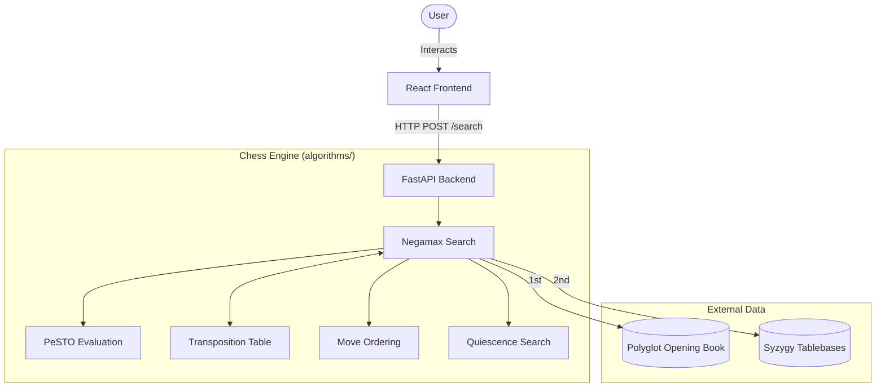
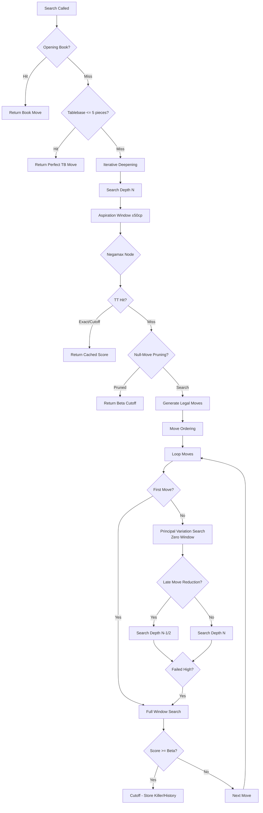
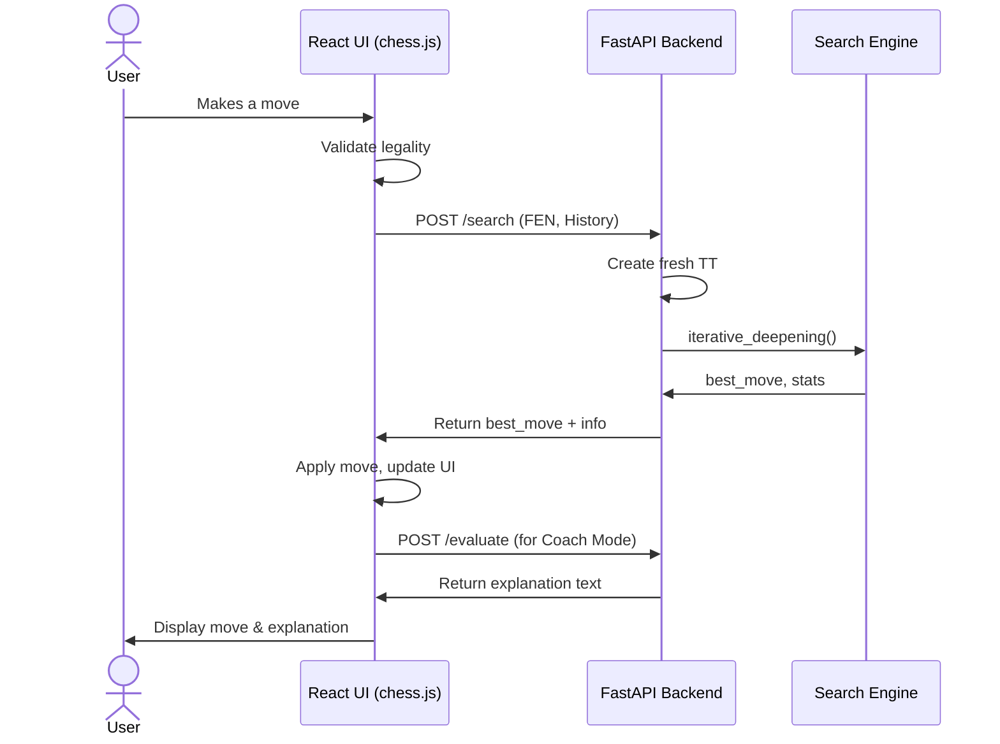

# Architecture Deep Dive

## System Overview

## Search Algorithm Pipeline

The core search uses Negamax with Alpha-Beta pruning, enhanced by several advanced heuristics.

1. **Opening book check**: Looks up the current position Zobrist hash in a Polyglot `.bin` file.
2. **Syzygy tablebase probe**: If ≤5 pieces remain, queries perfect endgame databases.
3. **Iterative Deepening**: Searches progressively from depth 1 to `max_depth`.
4. **Aspiration Windows**: Narrows the alpha-beta window to `±50 cp` around the previous iteration's score to induce faster cutoffs.
5. **Negamax + Alpha-Beta pruning**: The core tree search, exploiting the zero-sum nature of chess.
6. **Null-Move Pruning (R=3)**: Passes the turn to the opponent to prove a beta cutoff. Skipped in check or when only pawns remain.
7. **Principal Variation Search (PVS)**: Searches the first move with a full window, and subsequent moves with a zero-width window (`-α-1, -α`).
8. **Late Move Reductions (LMR)**: Reduces the search depth for late, quiet moves under the assumption they are unlikely to be best.
9. **Check Extensions**: Extends the search depth by 1 ply when giving check (capped at 3).
10. **Quiescence Search**: At leaf nodes, continues searching captures (and all moves in check) to resolve tactical sequences and avoid the horizon effect. Uses **Delta Pruning**.
11. **Transposition Table**: Caches results at every node to avoid redundant searches.

**Complexity**: With perfect move ordering, Alpha-Beta pruning reduces the time complexity from O(b^d) to O(b^(d/2)), effectively doubling the searchable depth.

## Evaluation Function

The engine uses a **PeSTO-style tapered evaluation** to smoothly transition between middlegame and endgame scoring.

- **Material values**: Separate values for middlegame (MG) and endgame (EG).
- **Piece-Square Tables (PSTs)**: 12 tables (6 piece types × 2 phases), totaling 768 values, assigning bonuses/penalties to specific squares.
- **Game phase tapering**: The game phase is calculated based on remaining non-pawn material (max 24). The final score is a weighted average of the MG and EG scores based on this phase.
- **Pawn structure**: Evaluates doubled, isolated, and passed pawns, connected passers, and rooks behind passed pawns.
- **Bishop pair bonus**: +30 cp for having both bishops.
- **Rook activity**: Bonuses for open and semi-open files.
- **King safety**: Pawn shield bonuses in the middlegame.
- **Hanging piece penalties**: Severe penalties for undefended attacked pieces.
- **Mop-up evaluation**: In overwhelming endgames, encourages driving the losing king to the edge and bringing the winning king close.
- **Specialist endgame evaluators**: Custom logic for KBN vs K (driving to the correct corner) and KBB vs K.
- **50-move rule decay**: Decays the winning score as the halfmove clock approaches 50 to encourage decisive progress.

**Total tunable parameters**: 803 (10 material + 768 PST + 25 bonuses).

## Texel Tuning Pipeline

To optimize the 803 evaluation parameters, a supervised learning approach called **Texel Tuning** was used.

1. **Dataset**: 100K+ positions generated from self-play, scored by Stockfish (CSV format: FEN + `eval_cp`).
2. **Design matrix**: Constructed an (N, 803) feature matrix representing the evaluation components for each position, with phase-tapering coefficients baked in.
3. **Loss function**: Mean Squared Error (MSE) between the sigmoid of the engine's evaluation and the sigmoid of Stockfish's evaluation.
   `Loss = MSE(sigmoid(our_eval/400), sigmoid(sf_eval/400))`
4. **Optimizer**: Used SciPy's `L-BFGS-B` (quasi-Newton method) with bounds and L2 regularization (λ=0.0001) to prevent parameter drift.
5. **Analytical gradients**: The gradient of the loss function was computed analytically (no numerical differentiation) for speed.
6. **Output**: The optimizer generated a new `tuned_weights.py` file.
7. **Result**: The tuned weights provided an ~80 ELO improvement over the original hand-tuned PeSTO weights.

## Move Ordering

Effective move ordering is critical for Alpha-Beta pruning. The engine uses a 5-tier priority system:

| Tier | Priority Score | Move Type | Description |
|---|---|---|---|
| 1 | 10,000 | **TT Best-Move** | The best move found in a previous search (cached in TT). |
| 2 | 9,000 | **Queen Promotions** | Almost always the strongest move. |
| 3 | 1,000+ | **Winning Captures** | Ordered by MVV-LVA (Most Valuable Victim - Least Valuable Attacker). `10 × victim_value - attacker_value` |
| 4 | 800 | **Killer Moves** | Quiet moves that caused a beta cutoff at the same ply in sibling nodes. (2 slots per ply). |
| 5 | 0–700 | **History Heuristic** | Tracks cutoff frequency for `(color, from_sq, to_sq)`. Incremented by `depth²` on cutoff. |

## Arena Adaptive Difficulty System

Arena mode uses a self-paced calibration system based on a **5×4 ELO ladder**:

| | 4th Best Move | 3rd Best | 2nd Best | Best Move |
|---|---|---|---|---|
| **Depth 3** | ~600 | ~750 | ~900 | ~1050 |
| **Depth 4** | ~1050 | ~1200 | ~1350 | ~1500 |
| **Depth 5** | ~1500 | ~1650 | ~1800 | ~1950 |
| **Depth 6** | ~1950 | ~2050 | ~2150 | ~2250 |
| **Depth 7** | ~2250 | ~2350 | ~2450 | ~2500 |

- **Calibration Phase**: The first game aggressively adjusts the level to find the player's approximate baseline.
- **Regular Phase**:
  - Win → advance (quality up, then depth up)
  - Loss → stay at current level
  - 2 Draws → advance one tier
- **Move Selection**: To simulate human-like blunders at lower levels, it doesn't just pick the strict "Nth best" move. It uses a 7-stage algorithm incorporating forced moves, mate-in-1 exceptions, blunder floors, and **Gaussian noise + band selection** based on the quality tier.

## Move Explanation Engine (Coach Mode)

The backend includes a rule-based engine (`explain.py`) to annotate moves and explain them to the user.

- **Feature Detectors**: Analyzes the board before and after a move to detect 15+ tactical and positional features (e.g., forks, pins, discovered attacks, back rank weakness, center control, development, passed pawns).
- **Annotation System**: Classifies moves based on the change in evaluation (`eval diff`):
  - `> +200 cp` = Brilliant (!!)
  - `> +50 cp` = Good (!)
  - `< -50 cp` = Inaccuracy (?!)
  - `< -100 cp` = Mistake (?)
  - `< -200 cp` = Blunder (??)

## Data Flow

