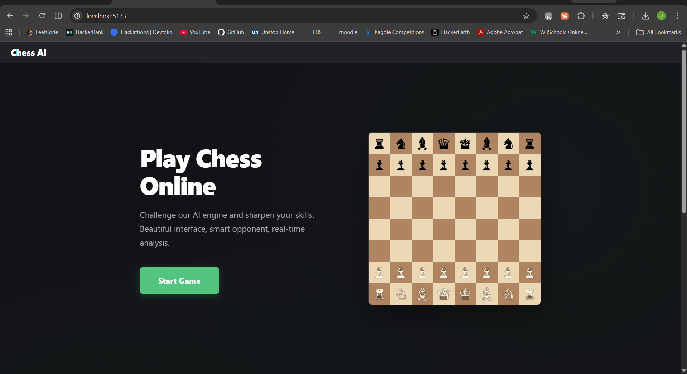
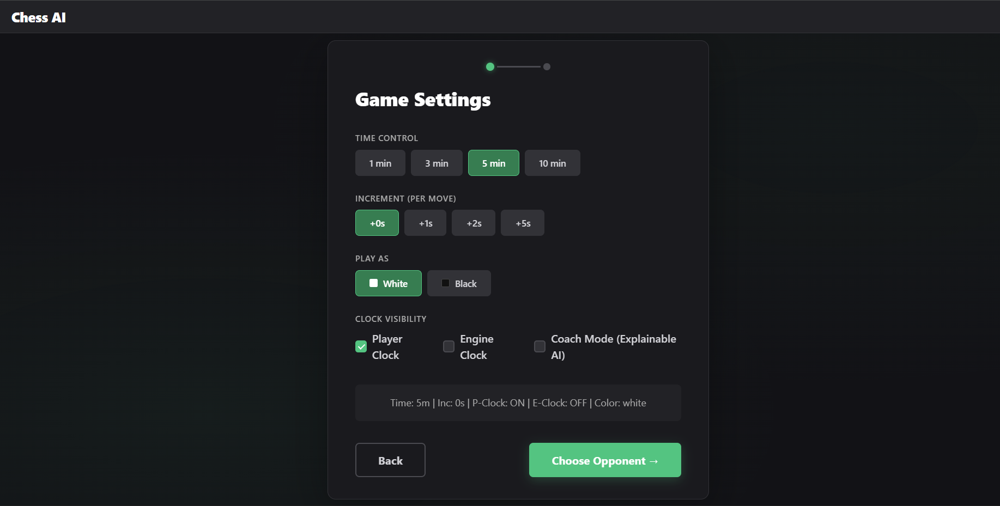
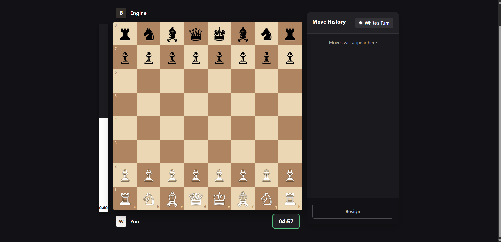

# Chess AI Mini Project WEBAPP

A full-stack chess project with a custom Python chess engine, a FastAPI backend, and a React frontend.

The project supports:
- Play vs multiple engine strengths
- Move search using alpha-beta style negamax with pruning/ordering heuristics
- Position evaluation and move explanations
- Post-game move-by-move analysis
- Self-paced Arena mode with adaptive estimated ELO
- Optional opening book and Syzygy tablebase probing

## 1) Project At A Glance

### Core flow
1. Frontend sends FEN/history requests to backend.
2. Backend calls modules in `algorithms/`.
3. Engine returns best move and search information.
4. Frontend renders board, eval graph, annotations, and coach hints.

### Tech stack
- Engine: Python + python-chess
- API: FastAPI + Uvicorn
- Frontend: React + TypeScript + Vite

## 2) Folder Structure

This is a practical overview of the repository structure (large data folders are shortened with `...`).

```text
AI_MINIPROJ/
|-- README.md
|-- test_sf.py
|-- kbn_trace.txt
|-- kbn_trace_150.txt
|
|-- algorithms/
|   |-- main.py                  # CLI chess game (play in terminal)
|   |-- search.py                # Negamax, alpha-beta, quiescence, pruning
|   |-- evaluation.py            # Position evaluation (material/positional)
|   |-- move_generation.py       # Legal move generation helpers
|   |-- move_ordering.py         # Move ordering heuristics
|   |-- transposition.py         # Transposition table logic
|   |-- openingbook.py           # Polyglot opening book loader
|   |-- tablebase.py             # Syzygy tablebase probing
|   |-- benchmark.py             # Engine benchmark scripts
|   |-- benchmark_live.py
|   |-- generate_dataset.py      # Training/eval dataset generation
|   |-- texel_tuning.py          # Eval weight tuning utilities
|   |-- tuned_weights.py
|   `-- ...
|
|-- backend/
|   |-- main.py                  # Backend entry point
|   |-- requirements.txt
|   |-- README.md
|   |-- app/
|   |   |-- __init__.py          # FastAPI app creation + router mounting
|   |   |-- routers/
|   |   |   |-- health.py        # /health
|   |   |   |-- algorithms.py    # /search, /evaluate, /analyze_game, etc.
|   |   |   `-- arena.py         # Adaptive arena endpoints
|   |   `-- utils/
|   |       |-- import_algorithms.py
|   |       `-- explain.py
|   `-- scripts/
|       `-- health_check.py
|
|-- frontend/
|   |-- package.json
|   |-- vite.config.ts
|   |-- index.html
|   |-- src/
|   |   |-- App.tsx              # Routes: landing, game, analysis, arena
|   |   |-- main.tsx
|   |   |-- pages/
|   |   |   |-- Landing.tsx
|   |   |   |-- Game.tsx
|   |   |   |-- Analysis.tsx
|   |   |   `-- Arena.tsx
|   |   |-- components/
|   |   |   |-- Chessboard.tsx
|   |   |   |-- EvalGraph.tsx
|   |   |   `-- ...
|   |   |-- hooks/
|   |   |   `-- useGameController.tsx
|   |   `-- utils/
|   |       `-- api.ts           # Backend API calls
|   `-- ...
|
|-- UI/                          # Alternate Python UI/testing scripts
|   |-- main.py
|   |-- game_controller.py
|   |-- landing.py
|   |-- chessboard.py
|   |-- test_kbn_mate.py
|   `-- ...
|
`-- data/
    |-- opening_book/
    |   |-- gm2001.bin (if present)
    |   `-- ...
    |-- syzygy/
    |   |-- 3-4-5/
    |   |   |-- KBNvK.rtbw
    |   |   |-- KBNvK.rtbz
    |   |   `-- ...
    |   `-- ...
    |-- stockfish/
    `-- training/
```

## 3) Simple Project Explanation

This is a chess application where your custom engine is the brain.

- The engine (inside `algorithms/`) chooses moves using search and evaluation.
- The backend (inside `backend/`) exposes that engine through HTTP APIs.
- The frontend (inside `frontend/`) gives a playable UI and analysis screens.
- Arena mode estimates player level by adapting depth/quality after each result.

In short: **engine logic + API layer + modern web UI**.

## 4) How To Run (Start To End)

### Prerequisites
- Python 3.10+
- Node.js 18+
- npm

### A) Create virtual environment (recommended)

From the project root:

Windows (PowerShell):

```bash
python -m venv .venv
.\.venv\Scripts\Activate.ps1
python -m pip install --upgrade pip
```

macOS/Linux:

```bash
python3 -m venv .venv
source .venv/bin/activate
python -m pip install --upgrade pip
```

### B) Run backend

From the project root:

```bash
cd backend
python -m pip install -r requirements.txt
uvicorn main:app --reload --port 8000
```

Backend URL:
- `http://127.0.0.1:8000`

Quick check:
- Open `http://127.0.0.1:8000/health`

### C) Run frontend

Open a second terminal from project root:

```bash
cd frontend
npm install
npm run dev
```

Frontend URL:
- `http://localhost:5173`

### D) Play / analyze
- Go to `/` for the landing page.
- Start a game vs bot.
- Use analysis page for post-game evaluation timeline and annotations.
- Use arena page for adaptive ELO calibration mode.

## 5) API Overview

Main endpoints served by backend:

- `GET /health`
- `GET /bots`
- `POST /search`
- `POST /evaluate`
- `POST /generate_moves`
- `POST /order_moves`
- `POST /analyze_game`
- `POST /tt/clear`
- `GET /tablebase/status`
- `POST /tablebase/probe`
- `GET /arena/session` (requires `X-Session-Id`)
- `POST /arena/search` (requires `X-Session-Id`)
- `POST /arena/result` (requires `X-Session-Id`)
- `POST /arena/reset` (requires `X-Session-Id`)

Interactive docs (Swagger UI):
- `http://127.0.0.1:8000/docs`

## 6) Engine Notes

Search and strength logic includes:
- Negamax + alpha-beta pruning
- Quiescence search
- Transposition table usage
- Move ordering
- Null-move pruning / search heuristics
- Optional opening book move selection
- Optional Syzygy tablebase probing for small endgames

## 7) Optional Data Setup

### Opening book
The engine tries these paths:
- `data/opening_book/gm2001.bin`
- `data/opening_book/book.bin`

If no `.bin` book is found, engine still runs normally.

### Syzygy tablebases
The engine tries these paths:
- `data/syzygy/3-4-5`
- `data/syzygy`
- `data/syzygy/regular`
- `data/syzygy/3-4`

If tablebases are missing, regular search is used.

## 8) Useful Commands

Run terminal engine game(play in the terminal):

```bash
python algorithms/main.py
```

Run backend health script:

```bash
python backend/scripts/health_check.py
```

Run frontend build:

```bash
cd frontend
npm run build
```

## 9) Screenshots

### Landing Page


### Game Settings Page


### Gameplay Page


## 10) Current Status

This repository already contains:
- Working engine modules
- Running API service structure
- React UI pages for game, analysis, and arena
- Data directories for opening books, tablebases, and training artifacts

You can now use this README as the main onboarding document for new contributors.
