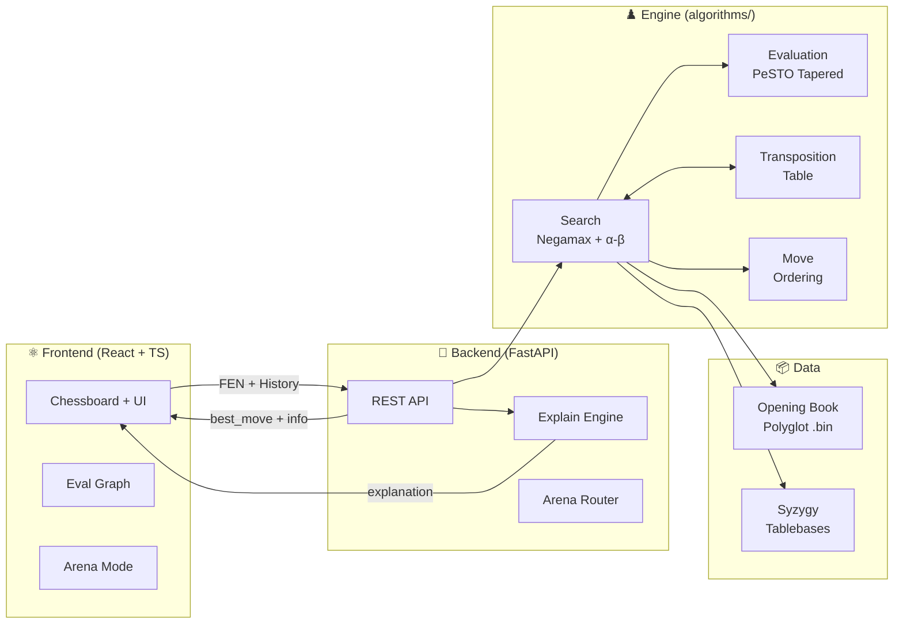

<div align="center">

# ♟️ Chess AI Engine

**A full-stack chess application with a custom-built engine, REST API, and modern web UI**

[](https://python.org)
[](https://fastapi.tiangolo.com)
[](https://react.dev)
[](https://typescriptlang.org)
[](https://vite.dev)

*A chess engine built from scratch — no ML models, no neural networks — just classical search algorithms and hand-crafted evaluation, tuned against 100K+ positions.*

</div>

---

## ✨ Features

| Feature | Description |
|---------|-------------|
| 🤖 **5 Bot Difficulty Levels** | From Beginner (~800 ELO) to Expert (~2300 ELO), each with unique personality and search depth |
| 🔍 **Deep Search Engine** | Negamax + Alpha-Beta with PVS, LMR, null-move pruning, quiescence search, and aspiration windows |
| 📊 **Post-Game Analysis** | Move-by-move review with eval graph, annotations (‼/!/⁈/?/??), and best-move arrows |
| 🏟️ **Arena Mode** | Adaptive difficulty system that estimates your ELO over multiple games using a 5×4 depth/quality ladder |
| 🎓 **Coach Mode** | Real-time move explanations — detects forks, pins, discovered attacks, hanging pieces, and 15+ tactical patterns |
| 📖 **Opening Book** | Polyglot-format grandmaster opening book for theoretically sound play |
| 🏁 **Syzygy Tablebases** | Provably perfect endgame play for ≤5 piece positions (KBN vs K, KRK, etc.) |
| ⚡ **Texel-Tuned Evaluation** | 803 parameters auto-optimized via L-BFGS-B against Stockfish evaluations |

---

## 📸 Screenshots

<div align="center">

| Landing Page | Game Settings | Gameplay |
|:---:|:---:|:---:|
|  |  |  |

</div>

---

## 🏗️ Architecture



> For a detailed technical deep-dive, see [ARCHITECTURE.md](ARCHITECTURE.md).

---

## 🧠 Engine Algorithms

The engine uses a pipeline of classical chess search techniques:

| # | Technique | Description |
|---|-----------|-------------|
| 1 | **Iterative Deepening** | Searches depth 1, then 2, then 3… always has a "best move so far" ready |
| 2 | **Aspiration Windows** | Narrow ±50 cp window around previous depth's score for more cutoffs |
| 3 | **Negamax + Alpha-Beta** | Core tree search exploiting zero-sum property; prunes irrelevant branches |
| 4 | **Principal Variation Search** | Zero-width window for non-PV moves; re-searches only on fail-high |
| 5 | **Null-Move Pruning** | "Skip a turn" heuristic (R=3); if still winning, prune the subtree |
| 6 | **Late Move Reductions** | Late quiet moves searched at reduced depth; re-search if they surprise |
| 7 | **Check Extensions** | +1 ply when giving check (capped at 3) to avoid missing short tactics |
| 8 | **Quiescence Search** | Resolves captures at leaf nodes to prevent horizon effect |
| 9 | **Delta Pruning** | Skips hopeless captures in quiescence when stand_pat + 1200 < α |
| 10 | **Transposition Table** | 2²⁰ entry Zobrist-hash cache; avoids re-searching known positions |

**Complexity**: Alpha-beta reduces search from O(b^d) to O(b^(d/2)) with perfect move ordering, where b ≈ 35 and d = search depth. Our effective branching factor is **~6–10** (vs. theoretical 35) thanks to aggressive pruning and ordering.

---

## 🏛️ Data Structures

| Data Structure | Module | Purpose |
|---------------|--------|---------|
| **Hash Table** (dict, max 2²⁰ entries) | `transposition.py` | Position cache keyed by Zobrist hash. Entry: `(depth, score, flag, best_move)`. Depth-preferred replacement; FIFO eviction. |
| **Zobrist Hash** (64-bit) | `transposition.py` | Incrementally updated board hash via XOR of random numbers per `(piece, square)`. O(1) lookup. |
| **Piece-Square Tables** (12 × 64 arrays) | `evaluation.py` | Positional bonuses per square for each piece, separate middlegame and endgame tables. |
| **Killer Move Slots** (2 per ply) | `move_ordering.py` | Fixed-size array of quiet moves that caused beta cutoffs at each search depth. |
| **History Table** (dict) | `move_ordering.py` | `{(color, from_sq, to_sq) → int}` tracking cutoff frequency. Incremented by depth². Capped at 700. |
| **Implicit Game Tree** (recursive DFS) | `search.py` | Tree never materialized in memory — explored via recursive Negamax. Memory: O(depth) not O(b^d). |
| **Polyglot Binary File** | `openingbook.py` | Sorted `(hash, move, weight)` entries. Lookup via binary search on Zobrist key — O(log n). |

---

## 📈 Evaluation Function

The static evaluation in `evaluation.py` (~700 lines) scores positions using a **tapered PeSTO architecture**:

| Component | Description | Impact |
|-----------|-------------|--------|
| **Material** | Tuned MG/EG piece values (P=82/94, N=337/281, B=365/297, R=477/512, Q=1025/936) | Primary signal |
| **Piece-Square Tables** | 768 positional values (6 pieces × 2 phases × 64 squares) from PeSTO | ±50 cp/square |
| **Pawn Structure** | Doubled (-15), isolated (-20), passed (up to +250 EG), connected passers, rook behind passer | ±15–250 cp |
| **King Safety** | Pawn shield bonus (+10/pawn, MG only) | ±10–30 cp |
| **Bishop Pair** | +30 cp for having both bishops | 30 cp |
| **Rook Files** | Open file (+25), semi-open (+12) | 12–25 cp |
| **Hanging Pieces** | Penalties for undefended attacked pieces (N=160, B=165, R=250, Q=450) | Blunder avoidance |
| **Mop-Up** | Endgame king pursuit — push losing king to edge, keep winning king close | Endgame finishing |
| **Specialist Endgames** | KBN vs K (correct corner drive) and KBB vs K custom evaluators | Perfect technique |
| **Phase Tapering** | Smooth MG↔EG blend based on remaining material (phase 0–24) | Smooth transitions |

> **803 total tunable parameters** — all optimized via Texel tuning (L-BFGS-B, 100K+ positions, analytical gradients).

---

## 📁 Project Structure

```text
AI_MINIPROJ/
├── algorithms/                    # ♟️ Chess engine core
│   ├── search.py                  #   Negamax, alpha-beta, PVS, LMR, quiescence
│   ├── evaluation.py              #   PeSTO tapered eval (803 parameters)
│   ├── move_ordering.py           #   MVV-LVA, killers, history heuristic
│   ├── transposition.py           #   Zobrist-hash TT (2²⁰ entries)
│   ├── openingbook.py             #   Polyglot opening book loader
│   ├── tablebase.py               #   Syzygy endgame tablebase probing
│   ├── texel_tuning.py            #   Automated eval weight optimization
│   ├── tuned_weights.py           #   Auto-generated optimized parameters
│   ├── benchmark.py               #   Self-play benchmarking (tuned vs original)
│   ├── benchmark_live.py          #   Live benchmark with full parameter swapping
│   ├── generate_dataset.py        #   Training position dataset generator
│   └── main.py                    #   CLI chess game (play in terminal)
│
├── backend/                       # 🐍 FastAPI REST API
│   ├── main.py                    #   Entry point (uvicorn)
│   ├── requirements.txt           #   Python dependencies
│   └── app/
│       ├── __init__.py            #   App creation + router mounting
│       ├── routers/
│       │   ├── health.py          #   GET /health
│       │   ├── algorithms.py      #   /search, /evaluate, /analyze_game, etc.
│       │   └── arena.py           #   Adaptive arena endpoints
│       └── utils/
│           ├── import_algorithms.py  # Dynamic module loader
│           └── explain.py         #   Move explanation engine (693 lines)
│
├── frontend/                      # ⚛️ React + TypeScript + Vite
│   ├── src/
│   │   ├── App.tsx                #   Routes: landing, game, analysis, arena
│   │   ├── pages/
│   │   │   ├── Landing.tsx        #   3-step wizard (hero → settings → bot select)
│   │   │   ├── Game.tsx           #   Main gameplay with eval + clock
│   │   │   ├── Analysis.tsx       #   Post-game review with eval graph
│   │   │   └── Arena.tsx          #   Adaptive ELO calibration hub
│   │   ├── components/
│   │   │   ├── Chessboard.tsx     #   8×8 board + SVG arrows
│   │   │   ├── EvalGraph.tsx      #   Pure SVG evaluation chart
│   │   │   ├── EvaluationBar.tsx  #   Vertical eval indicator
│   │   │   ├── Panel.tsx          #   Move list + resign button
│   │   │   ├── ExplainPopup.tsx   #   Coach mode explanations
│   │   │   └── ...
│   │   ├── hooks/
│   │   │   └── useGameController.tsx  # Central game state hook
│   │   └── utils/
│   │       └── api.ts             #   Backend API client
│   └── ...
│
├── UI/                            # 🖥️ Alternate Python UI / testing scripts
├── data/                          # 📦 Engine data files
│   ├── opening_book/              #   Polyglot .bin opening books
│   ├── syzygy/                    #   Syzygy tablebase files (.rtbw/.rtbz)
│   ├── stockfish/                 #   Stockfish binary (for benchmarking)
│   └── training/                  #   Training position datasets
│
└── screenshots/                   # 📸 UI screenshots
```

---

## 🚀 Getting Started

### Prerequisites

- Python 3.10+
- Node.js 18+
- npm

### 1. Clone & Setup

```bash
git clone https://github.com/Aj-Shaer07/AI_MINIPROJ.git
cd AI_MINIPROJ
```

### 2. Create Virtual Environment

**Windows (PowerShell):**
```bash
python -m venv .venv
.\.venv\Scripts\Activate.ps1
pip install --upgrade pip
```

**macOS / Linux:**
```bash
python3 -m venv .venv
source .venv/bin/activate
pip install --upgrade pip
```

### 3. Start Backend

```bash
cd backend
pip install -r requirements.txt
uvicorn main:app --reload --port 8000
```

Backend: http://127.0.0.1:8000 · Swagger docs: http://127.0.0.1:8000/docs

### 4. Start Frontend

Open a second terminal:

```bash
cd frontend
npm install
npm run dev
```

Frontend: http://localhost:5173

### 5. Play!

- `/` — Landing page → choose settings → pick a bot
- `/game` — Play against the engine
- `/analysis` — Post-game move-by-move review
- `/arena` — Adaptive difficulty calibration mode

---

## 📡 API Reference

### Core Engine

| Method | Endpoint | Description |
|--------|----------|-------------|
| `GET` | `/health` | Health check |
| `GET` | `/bots` | Returns 5 bot configurations |
| `POST` | `/search` | Find best move (Negamax search) |
| `POST` | `/evaluate` | Evaluate position + optional coach explanation |
| `POST` | `/generate_moves` | List all legal moves (UCI format) |
| `POST` | `/order_moves` | Order moves using heuristics |
| `POST` | `/analyze_game` | Batch analyze a completed game |
| `POST` | `/tt/clear` | Clear transposition table |

### Tablebases

| Method | Endpoint | Description |
|--------|----------|-------------|
| `GET` | `/tablebase/status` | Check if Syzygy tablebases are loaded |
| `POST` | `/tablebase/probe` | Probe WDL/DTZ for a position |

### Arena (Adaptive Difficulty)

| Method | Endpoint | Description |
|--------|----------|-------------|
| `GET` | `/arena/session` | Get current session state |
| `POST` | `/arena/search` | Search with quality-tier move selection |
| `POST` | `/arena/result` | Report game result → ELO adjustment |
| `POST` | `/arena/reset` | Reset session to baseline |

> All `/arena/*` endpoints require an `X-Session-Id` header.

Interactive API docs: http://127.0.0.1:8000/docs

---

## 📊 Performance & Benchmarks

### Engine Strength

| Bot Tier | Depth | Est. ELO | Percentile | Level |
|----------|-------|----------|------------|-------|
| 🐣 Martin (Beginner) | 3 | ~800 | ~5th | Casual beginner |
| 🙂 Jimmy (Casual) | 5 | ~1200 | ~35th | Club player |
| 🧐 Sven (Intermediate) | 4 | ~1500 | ~70th | Strong club |
| 🔥 Beth (Advanced) | 7 | ~2000 | ~93rd | Expert |
| 🤖 Magnus (Expert) | 6 | ~2300 | ~98th | Near-master |

### Search Efficiency

| Metric | Typical Value |
|--------|---------------|
| Nodes per move | 50K – 500K |
| Nodes per second | 100K – 300K NPS |
| Effective branching factor | ~6–10 (vs. theoretical ~35) |
| TT hit rate | 30–50% |
| Beta cutoff rate | 75–85% |
| Search depth reached | 5–8 ply (+ quiescence) |

### Texel Tuning Results

- **Parameters optimized**: 803 (material + PSTs + bonuses)
- **Training data**: 100K+ positions with Stockfish evaluations
- **MSE reduction**: 0.25 → 0.08
- **ELO gain**: +80 ELO over hand-tuned weights

---

## 🏟️ Arena Adaptive Difficulty

The Arena uses a **5×4 ELO ladder** combining search depth and move quality:

| | 4th Best | 3rd Best | 2nd Best | Best Move |
|---|:---:|:---:|:---:|:---:|
| **Depth 3** | 600 | 750 | 900 | 1050 |
| **Depth 4** | 1050 | 1200 | 1350 | 1500 |
| **Depth 5** | 1500 | 1650 | 1800 | 1950 |
| **Depth 6** | 1950 | 2050 | 2150 | 2250 |
| **Depth 7** | 2250 | 2350 | 2450 | 2500 |

- **Win** → advance (quality up, then depth up)
- **Loss** → stay at current level
- **2 draws** → advance one tier
- Move selection uses **Gaussian noise + band selection** for human-like play

---

## 🛠️ Tech Stack

| Layer | Technology | Purpose |
|-------|-----------|---------|
| **Engine** | Python 3.10+, python-chess | Core search + evaluation |
| **API** | FastAPI, Uvicorn | REST endpoints |
| **Frontend** | React 19, TypeScript, Vite 7 | Interactive web UI |
| **Routing** | React Router 6 | SPA navigation |
| **Validation** | chess.js | Client-side move validation |
| **Data** | Polyglot .bin, Syzygy .rtbw/.rtbz | Opening book + endgame tables |
| **Tuning** | NumPy, SciPy (L-BFGS-B) | Evaluation weight optimization |
| **Benchmarking** | Stockfish, custom harness | ELO estimation |

---

## 🔧 Engine Notes

### Optional Data Setup

**Opening Book** — the engine tries these paths (falls back to search if not found):
- `data/opening_book/gm2001.bin`
- `data/opening_book/book.bin`

**Syzygy Tablebases** — the engine tries these paths:
- `data/syzygy/3-4-5`
- `data/syzygy`
- `data/syzygy/regular`
- `data/syzygy/3-4`

### Useful Commands

```bash
# Play in terminal (no UI needed)
python algorithms/main.py

# Run backend health check
python backend/scripts/health_check.py

# Build frontend for production
cd frontend && npm run build

# Run Texel tuning
python algorithms/texel_tuning.py

# Run benchmark (tuned vs original)
python algorithms/benchmark.py --games 10 --depth 4
```
