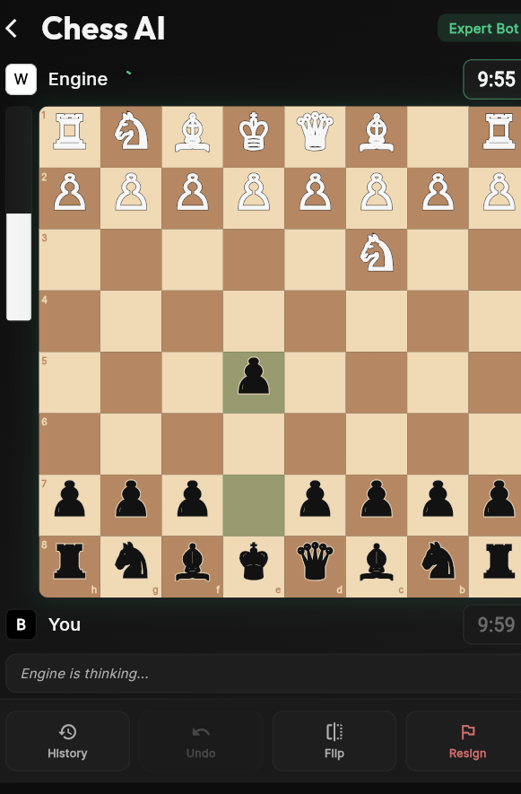

# MindGambit

MindGambit is a Flutter chess app with an AI engine, game screens, post-game analysis, and multi-platform support.

## Overview

This project focuses on the Flutter app in `mindgambit/`.

It includes:
- A chess board and gameplay UI
- AI engine logic for move search and evaluation
- Move history and post-game analysis
- Difficulty selection and game settings
- Android, iOS, web, Windows, macOS, and Linux targets

## Project Structure

```text
mindgambit/
|-- pubspec.yaml
|-- README.md
|-- lib/
|   |-- main.dart
|   |-- app.dart
|   |-- core/
|   |   |-- app_router.dart
|   |   `-- constants.dart
|   |-- engine/
|   |   |-- engine.dart
|   |   |-- evaluation.dart
|   |   |-- search.dart
|   |   |-- move_ordering.dart
|   |   |-- transposition.dart
|   |   |-- tablebase.dart
|   |   `-- explainer.dart
|   |-- models/
|   |   |-- difficulty.dart
|   |   |-- engine_result.dart
|   |   |-- game_state.dart
|   |   `-- timer_option.dart
|   |-- screens/
|   |   |-- home_screen.dart
|   |   |-- difficulty_screen.dart
|   |   |-- game_screen.dart
|   |   |-- post_game_analysis_screen.dart
|   |   `-- endgame_test_screen.dart
|   |-- theme/
|   |   |-- app_colors.dart
|   |   |-- app_text_styles.dart
|   |   `-- app_theme.dart
|   `-- widgets/
|       |-- chess_board_widget.dart
|       |-- move_history_panel.dart
|       |-- engine_evaluation_panel.dart
|       |-- coach_feedback_panel.dart
|       |-- explain_popup.dart
|       `-- ...
|-- android/
|-- ios/
|-- web/
|-- windows/
|-- linux/
`-- macos/
```

## Simple Explanation

The app works like this:

1. You choose a game mode or difficulty.
2. The board is shown in the Flutter UI.
3. The engine calculates the best move and evaluation.
4. The app updates the board, move history, and analysis panels.
5. After the game, you can review the move-by-move breakdown.

## Screenshots

### Landing Page
.png)

### Menu / Difficulty Selection


### Gameplay Screen


## Prerequisites

Before building or running the app, install the following:

- Flutter SDK: [Flutter install guide](https://docs.flutter.dev/get-started/install)
- Dart SDK: included with Flutter, see [Dart language overview](https://dart.dev/guides)
- Android Studio: [Download Android Studio](https://developer.android.com/studio)
- Android SDK and platform tools: [Android SDK setup](https://developer.android.com/tools)
- VS Code: [Download Visual Studio Code](https://code.visualstudio.com/)
- Git: [Download Git](https://git-scm.com/downloads)

Recommended checks:

```bash
flutter doctor
```

## How To Run

### 1. Open the app folder

```bash
cd mindgambit
```

### 2. Get dependencies

```bash
flutter pub get
```

### 3. Run the app

```bash
flutter run
```

### 4. Run on a specific device

```bash
flutter run -d android
flutter run -d chrome
flutter run -d windows
```

## Build The App

### Android APK

```bash
cd mindgambit
flutter build apk --release
```

APK output:

```text
mindgambit/build/app/outputs/flutter-apk/app-release.apk
```

### Web build

```bash
cd mindgambit
flutter build web
```

### Windows build

```bash
cd mindgambit
flutter build windows
```

## Download Android App

Prebuilt APK download link:

https://drive.google.com/file/d/1N_TEZByPrYFQzG3cJhTmHe2NOFpyjtJb/view?usp=sharing

Install note:
- If Android blocks installation, allow installs from unknown sources for the browser or file manager you use.

## App Features

- Chess board UI with piece movement
- AI engine integration
- Game settings and difficulty options
- Move history panel
- Evaluation and analysis screens
- Multi-platform Flutter support

## Notes

- If `flutter doctor` reports missing Android licenses, run `flutter doctor --android-licenses`.
- Make sure Android Studio has the Android SDK installed before building APKs.
- If you are building on Windows, use PowerShell or Command Prompt from the project folder.
